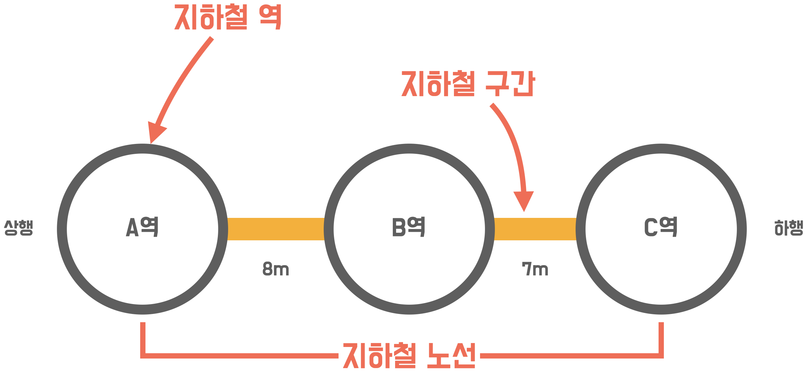
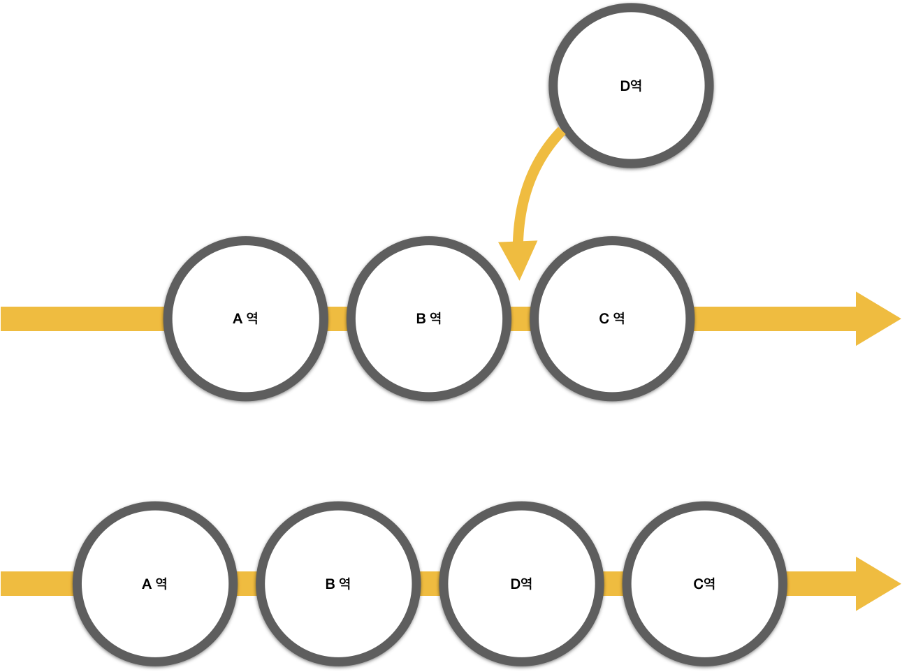
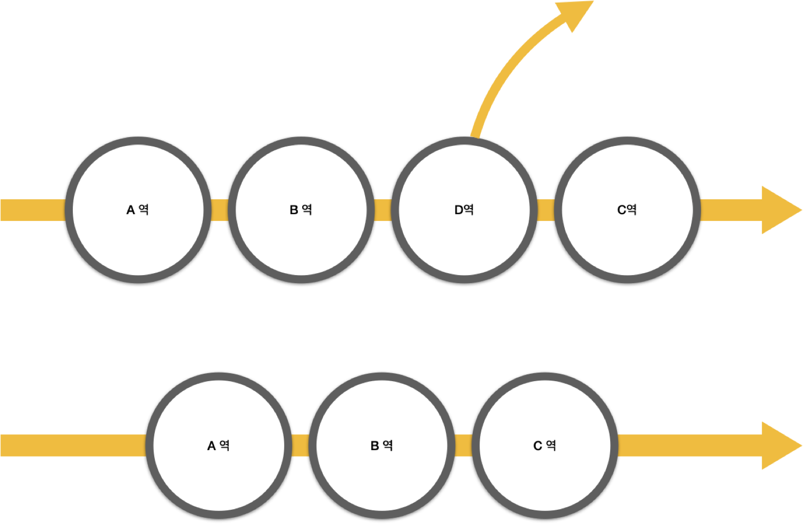

# 지하철 노선도 미션
- 지하철 역과 노선을 관리하는 지하철 노선도 기능을 구현한다.

<br>

## 🚀 기능 목록(Beta)



### 🚉 역 관리

#### 1. 역의 이름을 입력해서 새로운 역을 등록할 수 있다.
- 역의 이름은 2글자 이상이어야 한다.
- 이미 존재하는 역 이름인지 확인한다.
[ERROR] 이미 등록된 역 이름입니다.

#### 2. 역의 이름을 입력해서 삭제한다.
- 존재하는 역 이름인지 확인한다
[ERROR] 존재하지 않는 역입니다.
- 역 구간에서도 해당 역을 삭제한다.

#### 3. 존재하는 모든 역을 등록순으로 조회한다.
- 역이 존재하지 않는 경우 "[ERROR] 역이 없습니다"를 출력한다.

### 🚃노선 관리

#### 1. 노선의 이름을 입력해서 새로운 노선을 등록한다.
- 노선의 이름은 2글자 이상이어야 한다.
- 노선의 이름은 '선'으로 끝나야 한다.
- 이미 존재하는 노선 이름은 등록할 수 없다.

##### ① 상행 종점역을 입력받는다.
##### ② 하행 종점역을 입력받는다.
- 역의 이름은 2글자 이상이어야 한다.
- 존재하는 역 이름을 입력해야 한다.
- 하행 종점역은 상행 종점역의 이름과 달라야 한다.

#### 2. 노선의 이름을 입력해서 노선을 삭제한다.
- 노선 목록에 존재하는 노선이어야 한다.

#### 3. 존재하는 모든 노선을 등록순으로 조회한다.
- 노선이 존재하지 않을 경우 "[ERROR] 노선이 없습니다"를 출력한다.

### 🎢구간 관리



#### 1. 노선 명과 역 이름, 추가할 순서를 입력해서 구간을 새로 추가한다.
- 노선은 존재하는 노선이어야 한다.
- 역 이름은 존재하지 않는 역이어야 한다.
- 추가할 순서는 기존 구간의 크기를 초과해서는 안된다.



#### 2. 노선 명과 삭제할 역 이름을 입력해서 구간에 존재하는 역을 삭제한다.
- 노선은 존재하는 노선이어야 한다.
- 역 이름은 해당 구간 내에 존재하는 역이어야 한다.
- 노선에 포함된 역이 두개 이하일 때는 제거할 수 없다.

### 💻노선도 출력

#### 1. 모든 노선을 등록 순서대로 조회한다.
#### 2. 해당 노선에 존재하는 역 이름을 상행-하행 순서로 조회하면서 이름을 출력한다.

### ⌨지하철 프로그램

#### 1. 프로그램 초기화
- 역 관리-역 등록에서 "교대역, 강남역, 역삼역, 남부터미널역, 양재역, 양재시민의숲역, 매봉역"을 등록한다.
- 노선 관리-노선 등록에서 "2호선: 교대역-강남역", "3호선: 교대역-남부터미널역", "신분당선: 강남역-양재역"을 등록한다.
- 구간 관리-구간 등록에서 "2호선: 역삼역, 3", "3호선: 양재역, 3", "3호선: 매봉역, 4", "신분당선: 양재시민의숲역, 3"을 등록한다.

#### 2. 메인 화면
- 존재하는 모든 메뉴를 출력한다.
- 메뉴의 번호를 입력받는다(존재하지 않는 번호인 경우 다시 입력받는다)
- 1~4를 입력할 경우 세부 화면 출력으로 넘어간다.
- Q를 입력할 경우 프로그램을 종료한다.

#### 3. 세부 화면
- 해당 메뉴에 존재하는 세부 메뉴를 출력한다.
- 메뉴의 번호를 입력받는다(존재하지 않는 번호인 경우 다시 입력받는다)
- 1~3을 입력할 경우 해당 기능을 실행한다.
- B를 입력할 경우 메인 화면으로 돌아간다.


## ✖ 예외 목록
|발생 기능|예외 상황|출력 문구|
|---|------------|------------|
|역 등록, 노선 등록|노선과 역의 이름이 2자 미만일 때|[ERROR] 이름은 2글자 이상 입력해주세요.|
|역 등록|이미 존재하는 역 이름일 때|[ERROR] 이미 등록된 역 이름입니다.|
|구간 등록|이미 존재하는 역을 노선 구간에 등록하려고 할 때||
|역 삭제|존재하지 않는 역을 삭제하려고 할 때|[ERROR] 존재하지 않는 역입니다.|
|노선 등록|존재하지 않는 역을 노선에 등록하려고 할 때||
|역 조회|조회할 역이 없을 때|[ERROR] 해당 역은 존재하지 않습니다.|
|구간 삭제|삭제하려는 구간의 역이 존재하지 않을 때||
|노선 등록|이미 존재하는 노선 이름일 때|[ERROR] 이미 등록된 노선 이름입니다.|
|노선 등록|등록하려는 노선 이름이 '선'으로 끝나지 않을 때|[ERROR] 노선 이름은 '선'으로 끝나야 합니다.|
|노선 등록|동록하려는 노선의 상행 종점역과 하행 종점역이 같을 때|[ERROR] 노선의 상행 종점역과 하행 종점역은 달라야 합니다.|
|노선 삭제|존재하지 않는 노선을 삭제하려고 할 때|[ERROR] 존재하지 않는 노선입니다.|
|구간 삭제|존재하지 않는 노선의 구간을 삭제하려고 할 때|
|노선 조회|조회할 노선이 없을 때|[ERROR] 해당 노선은 존재하지 않습니다.|
|구간 삭제|삭제하려는 구간의 역이 2개 이하로 남았을 때|[ERROR] 2개 이하로 남은 구간은 삭제할 수 없습니다.|
|메인 화면|존재하지 않는 메뉴 번호를 입력했을 때|[ERROR] 목록에 있는 메뉴 번호를 입력해주세요.|
<br>

### 💻 프로그래밍 실행 결과 
#### 역 관리
```
## 메인 화면
1. 역 관리
2. 노선 관리
3. 구간 관리
4. 지하철 노선도 출력
Q. 종료

## 원하는 기능을 선택하세요.
1

## 역 관리 화면
1. 역 등록
2. 역 삭제
3. 역 조회
B. 돌아가기

## 원하는 기능을 선택하세요.
1

## 등록할 역 이름을 입력하세요.
잠실역

[INFO] 지하철 역이 등록되었습니다.

## 메인 화면
1. 역 관리
2. 노선 관리
3. 구간 관리
4. 지하철 노선도 출력
Q. 종료

## 원하는 기능을 선택하세요.
1

## 역 관리 화면
1. 역 등록
2. 역 삭제
3. 역 조회
B. 돌아가기

## 원하는 기능을 선택하세요.
3

## 역 목록
[INFO] 교대역 
[INFO] 강남역
[INFO] 역삼역
[INFO] 남부터미널역
[INFO] 양재역
[INFO] 양재시민의숲역
[INFO] 매봉역
[INFO] 잠실역

## 메인 화면
1. 역 관리
2. 노선 관리
3. 구간 관리
4. 지하철 노선도 출력
Q. 종료

## 원하는 기능을 선택하세요.
1

## 역 관리 화면
1. 역 등록
2. 역 삭제
3. 역 조회
B. 돌아가기

## 원하는 기능을 선택하세요.
2

## 삭제할 역 이름을 입력하세요.
잠실역

[INFO] 지하철 역이 삭제되었습니다.

...
```

### 노선 관리

```

...

## 메인 화면
1. 역 관리
2. 노선 관리
3. 구간 관리
4. 지하철 노선도 출력
Q. 종료

## 원하는 기능을 선택하세요.
2

## 노선 관리 화면
1. 노선 등록
2. 노선 삭제
3. 노선 조회
B. 돌아가기

## 원하는 기능을 선택하세요.
1

## 등록할 노선 이름을 입력하세요.
1호선

## 등록할 노선의 상행 종점역 이름을 입력하세요.
강남역

## 등록할 노선의 하행 종점역 이름을 입력하세요.
잠실역

[INFO] 지하철 노선이 등록되었습니다.

## 메인 화면
1. 역 관리
2. 노선 관리
3. 구간 관리
4. 지하철 노선도 출력
Q. 종료

## 원하는 기능을 선택하세요.
2

## 노선 관리 화면
1. 노선 등록
2. 노선 삭제
3. 노선 조회
B. 돌아가기

## 원하는 기능을 선택하세요.
3

## 노선 목록
[INFO] 2호선
[INFO] 3호선
[INFO] 신분당선
[INFO] 1호선

## 메인 화면
1. 역 관리
2. 노선 관리
3. 구간 관리
4. 지하철 노선도 출력
Q. 종료

## 원하는 기능을 선택하세요.
2

## 노선 관리 화면
1. 노선 등록
2. 노선 삭제
3. 노선 조회
B. 돌아가기

## 원하는 기능을 선택하세요.
2

## 삭제할 노선 이름을 입력하세요.
1호선

[INFO] 지하철 노선이 삭제되었습니다.

...

```

### 구간 관리

```
...

## 메인 화면
1. 역 관리
2. 노선 관리
3. 구간 관리
4. 지하철 노선도 출력
Q. 종료

## 원하는 기능을 선택하세요.
3

## 구간 관리 화면
1. 구간 등록
2. 구간 삭제
B. 돌아가기

## 원하는 기능을 선택하세요.
1

## 노선을 입력하세요.
2호선

## 역이름을 입력하세요.
잠실역

## 순서를 입력하세요.
2

[INFO] 구간이 등록되었습니다.

## 메인 화면
1. 역 관리
2. 노선 관리
3. 구간 관리
4. 지하철 노선도 출력
Q. 종료

## 원하는 기능을 선택하세요.
3

## 구간 관리 화면
1. 구간 등록
2. 구간 삭제
B. 돌아가기

## 원하는 기능을 선택하세요.
2

## 삭제할 구간의 노선을 입력하세요.
2호선

## 삭제할 구간의 역을 입력하세요.
잠실역

[INFO] 구간이 삭제되었습니다.

...

```

### 지하철 노선도 출력

```
## 메인 화면
1. 역 관리
2. 노선 관리
3. 구간 관리
4. 지하철 노선도 출력
Q. 종료

## 원하는 기능을 선택하세요.
4

## 지하철 노선도
[INFO] 2호선
[INFO] ---
[INFO] 교대역
[INFO] 강남역
[INFO] 역삼역

[INFO] 3호선
[INFO] ---
[INFO] 교대역
[INFO] 남부터미널역
[INFO] 양재역
[INFO] 매봉역

[INFO] 신분당선
[INFO] ---
[INFO] 강남역
[INFO] 양재역
[INFO] 양재시민의숲역

```

#### 에러 출력 예시

```
## 메인 화면
1. 역 관리
2. 노선 관리
3. 구간 관리
4. 지하철 노선도 출력
Q. 종료

## 원하는 기능을 선택하세요.
5

[ERROR] 선택할 수 없는 기능입니다.

## 원하는 기능을 선택하세요.
1

## 역 관리 화면
1. 역 등록
2. 역 삭제
3. 역 조회
B. 돌아가기

## 원하는 기능을 선택하세요.
1

## 등록할 역 이름을 입력하세요.
강남역

[ERROR] 이미 등록된 역 이름입니다. 

## 역 관리 화면
1. 역 등록
2. 역 삭제
3. 역 조회
B. 돌아가기

## 원하는 기능을 선택하세요.

...

```

<br>

## 📝 License

This project is [MIT](https://github.com/woowacourse/java-subway-map-precourse/blob/master/LICENSE.md) licensed.
